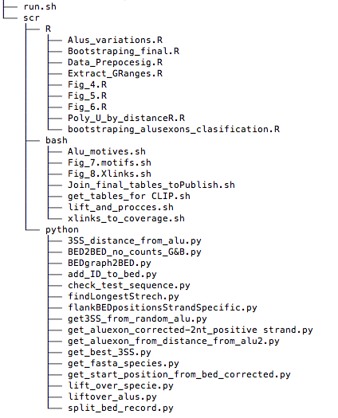

# Alu Evolutionary Analysis

# Plots
## Plots
### Plots
#### Plots
##### Plots
@@ Plots
@ Plots

5.  Plots
  Plots

|Link|Description|
|---|-----------|
|[Figure 4](scr/R/Fig_4.R)| 3´ss position - 3´ss density - 3´ss heatmap     |
|[Figure 5](scr/R/Fig_5.R)| 3´ss strengthening coupled with U lengthening            |
|[Figure 6](scr/R/Fig_6.R)|      3´ss and U track Contigency table          |
|[Figure 7](scr/bash/Fig_8.Xlinks.sh)|       3´ss Alignments  - Motifs        |
|[Figure 8](scr/bash/Fig_7.motifs.sh)|      RBP Xlinks on Alu evolutionary paths and U track lengths      |

6.  Plots
  Plots

|Script|description|
|---|-----------|
|Figure 4 |                 |[Read more words!](scr/R/Fig_4.R)|
|Figure 5 |[Read more words!](scr/R/Fig_5.R)|
|Figure 6 |[Read more words!](scr/R/Fig_6.R)|
|Figure 7 |[Read more words!](scr/bash/Fig_8.Xlinks.sh)|
|Figure 8 |[Read more words!](scr/bash/Fig_7.motifs.sh)|

2.  

# General structure
###Source Code Overview

1.  Preprocess Alu exon position
2.  

## example usage
See `run.sh` for sample code usage

