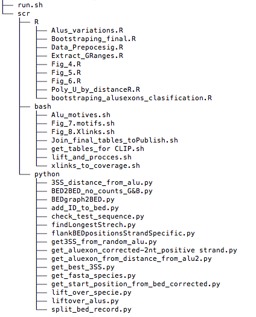

# Alu Evolutionary Analysis

###
### 1.  Main Pipeline

This pipeline will produce all the analysis and the plots from this thesis. Each script contain detailed information on usage and action are comented line by line.

All the programes here described are piped by `run.sh` script  [run.sh](run.sh) It start with some data reordering, filtration and  3´ss testing. Select only Alus that are on antisense, sort and get uniques. Those unique were intersected with Alu TE from repeat masker. Then we measure the distance from the 3´ss to the Alu TE end.

Same procccess were taken for random Alus.

Posteriously it calls all bellow scripts until plots.

#### Usage:
`bash run.sh`

#### Scripts called
|Link|Description|
|---|-----------|
|[ get_start_position_from_bed_corrected.py ](scr/python/get_start_position_from_bed_corrected.py )| get the start position from a bed file. Used to get the 3'ss of alu exonsCheck the best 3SS score in 2nt upstream and 2nt downstream     |
|[ get_best_3SS.py  ](scr/python/get_best_3SS.py )|   Check the best 3SS score in 2nt upstream and 2nt downstream   |
|[ add_ID_to_bed.py ](scr/python/add_ID_to_bed.py )|   ADD ID to column 4th. Id is formed by the joining of Bed positions   |
|[ 3SS_distance_from_alu.py ](scr/python/3SS_distance_from_alu.py )|  The script will get the distance between 3ss and Aluexon start     |
|[ get3SS_from_random_alu.py ]( scr/python/get3SS_from_random_alu.py )|   get the 3'SS 20 nt inside alu element    |

###
### 2.  Lift Over and Proccess full table

Main script [ lift_and_procces.sh  ](scr/bash/lift_and_procces.sh )

Script is feed by a bed file with Alu exons 3´ss position separated by tab

    chr      start      end     Alu_exon_ID      Alu_class      strand      3´ss_distance_to_Alu

#
1. Lift over the 3´ss to diferent genomes
2. Split the bed file on individual files. Each bed line to a different bed file
3. Get MaxEntSplice site score
4. Get fasta sequence, check that is correct and measure the longest U streech  - Whole alu
5. Get fasta sequence, check that is correct and measure the longest U streech  - right arm
6. Get fasta sequence, check that is correct and measure the longest U streech  - left arm
7. Return a tabular table with all of those results ordered in columns:
#

        chr     start   end      aluexon    position    strand      distance_to_alu     X3SSS   LongestUTrack   UTrack_Left     UTrack_right

#
#### Usage:
` bash ./src/bash/lift_and_procces.sh Aluexons_3SS_hg19_Distance.bed OutDIR  `

#### Scripts called
|Link|Description|
|---|-----------|
|[ lift_over_specie.py]( scr/python/lift_over_specie.py)|  Lift over bed file to a new bed file specifying the specie conversion. Optional flag to get fasta from those liftovers Seq|
|[ split_bed_record.py ]( scr/python/split_bed_record.py)|   Return and split each line in separate file with file name equal to string repesenting the bed position on the genome   |
|[ flankBEDpositionsStrandSpecific.py ]( scr/python/flankBEDpositionsStrandSpecific.py )|  The script will flank the region in both directions in a new bed file.   |
|[ get_fasta_species.py ]( scr/python/get_fasta_species.py )|  Get fasta sequence from a specified genome  |
|[ check_test_sequence.py ]( scr/python/check_test_sequence.py )|  Check that the fasta sequence is apropiate for downstream analysis    |
|[findLongestStrech.py ]( scr/python/findLongestStrech.py)|  Find the longest strech of a given letter in a string (case insensitive)    |
|[ get_aluexon_from_distance_from_alu2.py ]( scr/python/get_aluexon_from_distance_from_alu2.py)|  The script will get the distance between 3ss and Alu start    |

### 3.  3´ss features

Main script [ Fig_4._3ss_Features.R  ]( /scr/R/Fig_4._3ss_Features.R )

#### Usage:
` Rscript ./scr/R/Fig_4._3ss_Features.R `

### 4.  3´ss coupled with U track lenght

Main script 
#### Usage:
`   `

#### Scripts called
|Link|Description|
|---|-----------|
|[ Fig_5.R ]( scr/R/Fig_5.R)|   Funcion to plot at the same time 3´ss UTrack on the whole Alu, right and left arms   |
||      |
||      |
||      |
||      |

### 5.  Contingency tables

Main script [ Fig_6_Contingency table.R  ]( scr/R/Fig_6_Contingency%20table.R )
#### Usage:
` Rscript ./src/R/Fig_6_Contingency%20table.R  `

### 6.  Allu 3´ss alignment and motif discovery

Main script [ Alu_motives.sh ]( scr/bash/Alu_motives.sh )

Grab needded columns columns from Wide.tab table

Feed with a Full Alu Evolutionary table in tab format.
WebLogo alignemt on Alu evolutionary paths From -60 nt of the 3´s to 15 nt upstream
Dreme motives on Alu evolutionary paths uspreaam and downstream the 3´s. From -60 nt of the 3´s to 15 nt upstream
#

Script produces all the plots on Figure 7
#### Usage:
` bash  ./scr/bash/Alu_motives.sh `

#### Scripts called
|Link|Description|
|---|-----------|
|[ get_fasta_species.py ]( scr/python/get_fasta_species.py )|  Get fasta sequence from a specified genome  |
|[ meme athgorithm ](http://meme-suite.org/ )|   Motif discovery tool HMM based   |
|[ Tomtom ](http://meme-suite.org/tools/tomtom )|   Search on JASPAR RNA motif database  |
|[Figure 7](scr/bash/Fig_8.Xlinks.sh)|       3´ss Alignments  - Motifs        |

### 7.  iCLIP RBP binding data

Main script [ xlinks_to_coverage.sh ]( scr/bash/xlinks_to_coverage.sh )
#### Usage:
` bash  ./scr/bash/xlinks_to_coverage.sh  `

#### Scripts called
|Link|Description|
|---|-----------|
|[ xlinks_to_coverage.sh ]( scr/bash/xlinks_to_coverage.sh )|   Function to assign xlinks to BED file   |
|[ get_tables_for_CLIP.sh  ]( scr/bash/get_tables_for%20CLIP.sh )|      |
|[ Fig.8:Xlinks.R ]( scr/R/Fig.8:Xlinks.R )|   Plot iCLIP data   |

### 8.  Plots
  Most of the plots were obtained on R using RStudio IDE

|Link|Description|
|---|-----------|
|[Fig_4._3ss_Features.R](scr/R/Fig_4._3ss_Features.R)| 3´ss position - 3´ss density - 3´ss heatmap     |
|[Figure 5](scr/R/Fig_5.R)| 3´ss strengthening coupled with U lengthening            |
|[Fig_6_Contingency%20table.R](scr/R/Fig_6_Contingency%20table.R)|      3´ss and U track Contigency table          |
|[Fig_7.motifs.sh](scr/bash/Fig_7.motifs.sh)|       3´ss Alignments  - Motifs        |
|[Fig.8:Xlinks.R](scr/bash/Fig.8:Xlinks.R)|      RBP Xlinks on Alu evolutionary paths and U track lengths      |

###Source Code Overview

